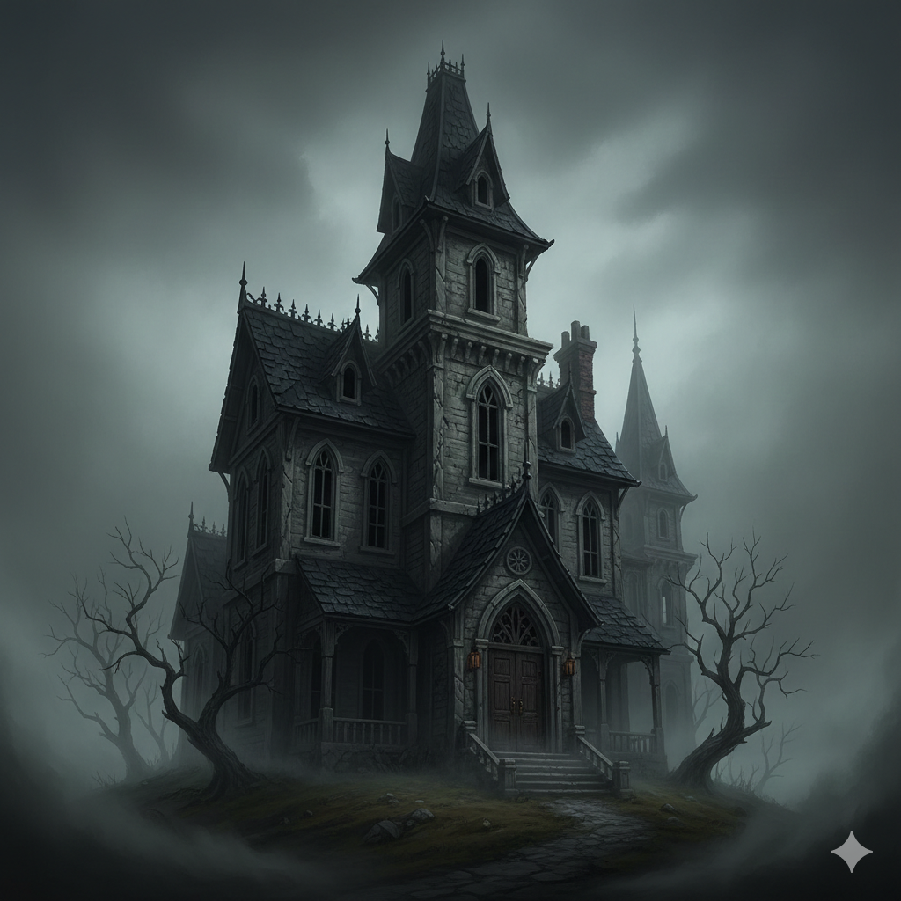

# Roster 

%% Keep track of who turned up. %%

`INPUT[inlineListSuggester(optionQuery(#Category/Player)):sessionRoster]`

## Absent

%% Keep track of who didn't turn up. %%

`INPUT[inlineListSuggester(optionQuery(#Category/Player)):sessionAbsent]`

# Session Overview

The party meets for the first time, only to be mysteriously drawn into the dread domain of Barovia and trapped within the deadly House of Lament.

## The Narrative
Before the mists claimed them, Vinarius, Tildrak, and Nirthar were strangers who happened to gather at a local pub after completing a mundane wine escort mission. Here they encountered a mysterious **Vistani Troubadour** who, seemingly without their knowledge, marked them. The next day, as they traveled through a forest toward their next assignment, the clouds and fog grew unnaturally dense and magical. Disoriented and swallowed by the mists, they soon found themselves transported entirely into a gloomy, fog-choked new world.

Seeking shelter on the unfamiliar road, they were drawn to a tall, brooding townhouse by the cries of two children, **Rose and Thorn**, who begged them to stop a "monster" in their basement. Stepping inside the Durst House, they quickly realized the front doors had vanished behind them.

Exploring the upper floors, the party uncovered the tragic and twisted history of the Durst family. They learned that the family patriarch had an affair with the maid, resulting in an illegitimate child named Walter. Driven by jealousy, the obsessed wife formed a sadistic cult focused on retaining eternal youth and desperately seeking the attention of Strahd von Zarovich, ultimately resulting in the murder of the maid and the tragic stillborn death of Walter. Unlike many adventurers who strike first, the party used diplomacy to peacefully navigate an encounter with the **Nursemaid's Specter**, avoiding a fight and confirming the house's dark history.

Descending into the dungeon below the house, they found the secret lair of the Durst cult. At the bloodstained altar, a sinister voice demanded a sacrifice: *"One must die."* Refusing to murder one of their own or an innocent child, the party sacrificed a **rat** to sate the altar's hunger. However, this paltry offering angered the cult's remnants. The tragic child, Walter, manifested into a massive, horrifying flesh-amalgamation. Pushed to their absolute limits, the party desperately managed to slay the shambling terror. 

With the terrifying beast defeated, the heavy atmosphere in the house suddenly lifted. As they caught their breath, an imposing figure materialized before them: **Strahd von Zarovich**, the ruler of Barovia. Despite knowing externally who he was—the ultimate villain on the adventure cover—the characters were caught off-guard. Rather than attacking, Strahd applauded them for their courage and heroism in clearing out the house. Thoroughly amused, he officially invited them to visit him at Castle Ravenloft before gracefully departing. The party then stepped safely out of the Durst House and into the foggy, oppressive streets of the **Village of Barovia**, strangers in a strange land with nothing but their gear and an invitation from a dark lord.

## The Facts
*   **The Mists:** A Vistani Troubadour secretly marked the party, causing them to be magically transported through dense fog into Barovia the following day.
*   **The Durst Family:** The party explored the Durst House, uncovering the twisted history of the cult, the maid, and the stillborn child Walter.
*   **The Sacrifice:** The party refused to make a human sacrifice at the cult's altar, opting to sacrifice a rat instead.
*   **The Shambling Terror:** The party successfully defeated the flesh-amalgamation of Walter.
*   **A Dark Invitation:** Strahd von Zarovich personally appeared, applauded their heroism, and extended an open invitation to Castle Ravenloft.
*   **Welcome to Barovia:** The party has formally arrived in the Village of Barovia, battered and in need of shelter.

## Open Questions
*   Who was the Vistani Troubadour, and why did he pull this specific group into Barovia?
*   How will the party survive in the Village of Barovia with their limited resources?