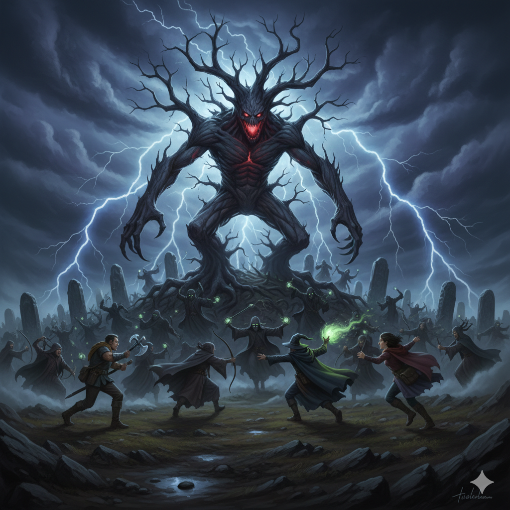

# Roster 

%% Keep track of who turned up. %%

`INPUT[inlineListSuggester(optionQuery(#Category/Player)):sessionRoster]`

## Absent

%% Keep track of who didn't turn up. %%

`INPUT[inlineListSuggester(optionQuery(#Category/Player)):sessionAbsent]`

# Session Overview

%% I like to keep a quick summary of sessions here. %%

The party successfully assaults Yester Hill, recovering the stolen eternal gemstone but paying a gruesome physical and spiritual price in the process.

## The Narrative
Tasked by Davian Martikov to retrieve the stolen magic gem needed to grow the winery's grapes, the party traveled to Yester Hill. Arriving at the hilltop, they discovered a terrifying ritual underway: evil druids and fierce berserkers were attempting to summon a massive creature known as Wintersplinter in honor of Strahd, hoping to prove their worth and become more integrated into his "army of servants." 

The party fought desperately to stop the summoning, cutting through the frantic druids and their berserker bodyguards. Watching the carnage from the sidelines for sheer entertainment was the devil Strahd von Zarovich himself. Amused by the spectacle but annoyed that the party was spoiling his "present," Strahd stepped in and finished the summoning himself, bringing forth a gargantuan Tree Blight. Satisfied that the exciting part was over, Strahd quickly departed, leaving the party to deal with his new pet.

Before he left, however, Tildrak hurled a sharp insult at the vampire lord. Irritated, Strahd attempted to effortlessly flick Tildrak away just as he had done in Vallaki. But this time, a sudden, immense surge of power unexpectedly offered itself to Tildrak. Firmly believing it to be a miraculous divine intervention from his god, Tyr, Tildrak accepted the power and successfully resisted the vampire's magic.

The party ultimately prevailed, slaying the Tree Blight and recovering the eternal gemstone from its roots. Following the victory, a mysterious vision of the **Huntress of the Forest Fane** appeared to them:

> [!quote]- The Huntress's Vision
> *Heroes and misfits,* 
> *Thank you for not allowing evil to corrupt these fertile lands, though the tasks are not yet finished.*
> *I call upon you to restore this monument, to worship Death.*
> *Do not mistake, Death is not Evil, everything is owed an end, and it's unnatural to avoid its grasp.*
> *Under the Gulthias Tree you'll find the entrance to my place of worship; although you'll need the power of the sun to survive there.*
> *Come back once you've grown radiant, and this will be the first step to rid this land of the unnatural evil.*

Enraged by the vision, Tildrak suddenly grabbed a magic battle axe lying nearby and struck the Gulthias Tree, severing the fane's connection. As the axe bit into the wood, the Huntress's voice screamed in agony: *"Nooooo! You fool, you're breaking the con..ne..e..e.."*

The sudden fit of rage immediately ended, leaving Tildrak completely unaware of what had just overcome him and with no memory of his own actions against the tree.

Despite the warnings regarding the portal's lethal, timeless nature, the party's curiosity got the better of them. Investigating the pitch-dark gateway between the tree's roots, Borgür recklessly reached his bare hand inside. His limb rapidly withered away to dust in a matter of seconds, leaving him with only a deeply scarred stump.

## The Facts
*   **The Summoning:** The party interrupted a druidic ritual to summon Wintersplinter. The druids aimed to honor Strahd and join his army.
*   **Strahd's Interference:** An amused Strahd personally completed the summoning because he felt the party was ruining his "present," then departed because the exciting part was over.
*   **The Unwilling Pact:** After insulting Strahd before his departure, Tildrak successfully resisted the vampire's attempt to effortlessly flick him away by accepting an unexpected surge of power he mistook for the divine influence of his god, Tyr.
*   **The Gem Recovered:** The party defeated the Tree Blight and successfully reclaimed the stolen eternal gemstone for the winery.
*   **The Huntress's Vision:** The party was contacted by the Huntress of the Forest Fane, who asked them to restore her monument via a portal under the Gulthias Tree—but warned them they first needed the "power of the sun."
*   **The Possession of Tildrak:** Tildrak inexplicably attacked the Gulthias Tree with a magic battle axe, severing the fane's connection. He was left with no memory of the event and no understanding of what overcame him.
*   **Borgür's Hand:** Ignoring the vision's warning, Borgür stuck his arm into the dark portal. His hand rapidly aged to dust in a sub-realm of death, leaving him permanently mutilated with a stump.

## Open Questions
*   How will the loss of his hand affect Borgür moving forward?
*   What is the "power of the sun" mentioned by the Huntress, and where can the party find it?
*   What are the negative consequences of Tildrak unknowingly accepting help from dark entities he believes to be Tyr?
*   How will the Martikovs react now that the eternal gemstone has been recovered?

