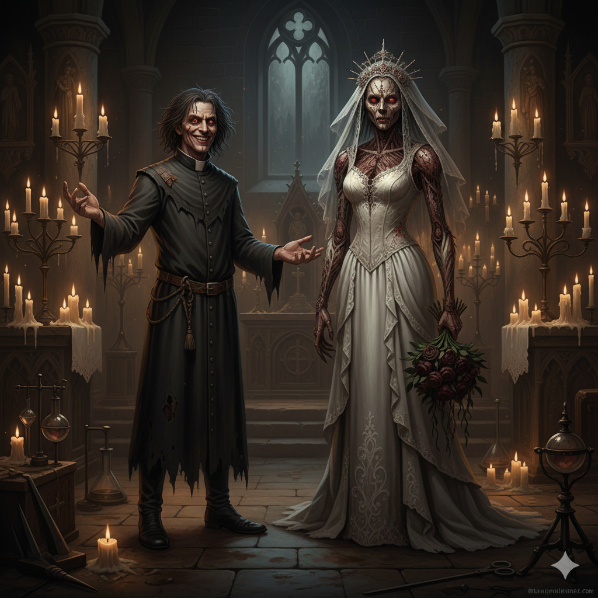

# Roster 

%% Keep track of who turned up. %%

`INPUT[inlineListSuggester(optionQuery(#Category/Player)):sessionRoster]`

## Absent

%% Keep track of who didn't turn up. %%

`INPUT[inlineListSuggester(optionQuery(#Category/Player)):sessionAbsent]`

# Session Overview

# Session Overview

The party explores the deeply unsettling Abbey of Saint Markovia, discovering horrific secrets hidden by the enigmatic Abbot and learning shocking truths about Strahd's past and Tildrak's magical mark. After gaining a powerful new ally in the vampire hunter Ezmerelda d’Avenir, the heroes embark on a deadly hunt to infiltrate a werewolf den and rescue kidnapped children from a gruesome fighting pit.

## The Narrative

### Inside the Abbey of Saint Markovia

Following their entry into Krezk, Borgür, Tildrak, Vinarius, and Nirthar were granted access to the Abbey of Saint Markovia at the top of the hill. There, they were greeted by a calm, softly-spoken young priest who introduced himself simply as "the Abbot." Despite his polite demeanor, an ominous tension hung in the air, punctuated by bizarre, animalistic noises echoing through the halls—sounds that did not belong in a holy sanctuary.

When the Abbot temporarily excused himself to investigate the noises, the party took the opportunity to snoop. They found a large statue of the Morninglord, but their exploration was interrupted by a ringing bell and more unidentifiable sounds. Nirthar stealthily trailed the Abbot and discovered a heavily secured door locked with intricate magic. Utilizing the ethereal nature of Borgür's phantom hand, they managed to unlock the door from the inside out.

Beyond the door, the temperature dropped. As they crept through the cold, abandoned corridors, the grotesque sound of creatures eagerly feasting grew louder. Peering through a small hatch, Nirthar caught sight of a horribly deformed, humanoid figure with a twisted, Quasimodo-like posture. Pushing further into the storage areas, they found barrels, sacks of flour, and disturbingly large quantities of raw meat on the bone. The horrifying noises were not their imagination.

### The Divine Mark and the Macabre Bride

As the group prepared to force open a final, heavily barricaded door, the Abbot suddenly reappeared, urgently warning them away from whatever lurked in the cellar. The tense standoff shifted gears when Tildrak brought up his Mark of Atonement, claiming a divine connection to the Morninglord. The Abbot was immediately dismissive and visibly jealous, claiming he himself had never experienced such a direct divine link. 

To test Tildrak's claim, the Abbot performed a dangerous diagnostic ritual on Tildrak's arm—one that threatened to destroy the limb entirely. During the tense ritual, golden magic flared and a fleeting vision of angelic wings materialized. The Abbot drew a stunning conclusion: Tildrak's mark did not originate from any god of Faerûn, but rather seemed tied directly to Strahd von Zarovich himself.

This revelation prompted a massive lore drop from the Abbot regarding Strahd's dark history: his burning jealousy toward his brother Sergei, Sergei's murder, Tatyana's tragic suicide, and the dark curse that binds Strahd to Barovia. The Abbot dismissed Ireena as a "soulless" replica and revealed his own twisted solution to breaking Strahd's curse: he had constructed the "perfect bride" for the vampire lord. 

He introduced them to Vasilka—a horrifying flesh golem meticulously stitched together from human flesh and bone. The Abbot maintained a delusional insistence that Vasilka and the other deformed inhabitants of the Abbey were "good people" under his righteous care.

### A New Ally and the Werewolf Hunt

Hearing unexpected noises coming from upstairs, the party went to investigate. As they explored the upper floor, the escalating tension in the Abbey was suddenly shattered when a woman in red materialized from the shadows, pressing a knife tight against Nirthar's throat. She introduced herself as Ezmerelda d’Avenir, a vampire hunter and the protégé of the legendary Rudolph van Richten. The crew instantly recognized the name and put the pieces together: the eccentric bard "Rictavio" they had met back in Vallaki was none other than Van Richten in disguise.

Ezmerelda made it clear she didn't trust the Abbot and demanded to know if the party worked for Strahd. She was ultimately convinced they did not, simply because they behaved like such amateurish, bumbling fools that Strahd would never hire them directly. With that insulting, yet effective, proof established, they forged a quick alliance. 

Before leaving the disturbing Abbey behind, the Abbot made one final request of the party. He pleaded with them to find a proper wedding dress for Vasilka—the only missing piece required to complete her, alongside some training, so she could finally become Strahd's bride. The party agreed to keep an eye out and departed the Abbey alongside Ezmerelda to focus on the immediate threat: hunting the werewolves plaguing Krezk. 

Passing through the village, they witnessed the mourning ritual for Ilya Kreskov, the Burgomaster's son who had succumbed to a mysterious illness. Outside the town walls, the hunt began. Utilizing silver, magic, and absolute stealth, the party successfully ambushed and dispatched two outer-perimeter werewolves.

### The Den of the Pack

Following the trail along a treacherous, narrow cliff edge, the group infiltrated the hidden werewolf den. Inside, they uncovered a nightmarish arena holding captive wolves, human adults, and kidnapped children. From their vantage point, they watched in horror as the leader of the werewolf pack announced a brutal initiation ritual: the captive children would be forced to fight to the death, and only the sole survivor would be deemed worthy to join the pack.

The heroes realized they were stumbling right into a bloodbath—but they were just in time to stop it.

## The Facts
*   **The Abbot's Nature:** The Abbot of Saint Markovia is deeply delusional, harboring deformed mutants and assembling a flesh golem named Vasilka as a "bride" for Strahd.
*   **Tildrak's Mark:** The Abbot's magical examination concluded that Tildrak's radiant "Mark of Atonement" is linked to Strahd, not a traditional deity.
*   **Rictavio's Identity:** The party learned from Ezmerelda d’Avenir that the bard Rictavio is actually the legendary vampire hunter Rudolph van Richten.
*   **The Werewolf Den:** The party has successfully infiltrated the local werewolf den just as the pack leader is forcing captive children into a fight to the death.

## Open Questions
*   How will the party intervene to save the children from the werewolf initiation ritual?
*   What is the true nature of the connection between Tildrak's "divine" mark and Strahd von Zarovich?
*   Where in Barovia can the party possibly find a suitable wedding dress for a flesh golem?
*   What horrific entity is the Abbot keeping behind the heavily barricaded cellar door?
*   How will the revelation of Rictavio's true identity impact the party's future dealings with him?