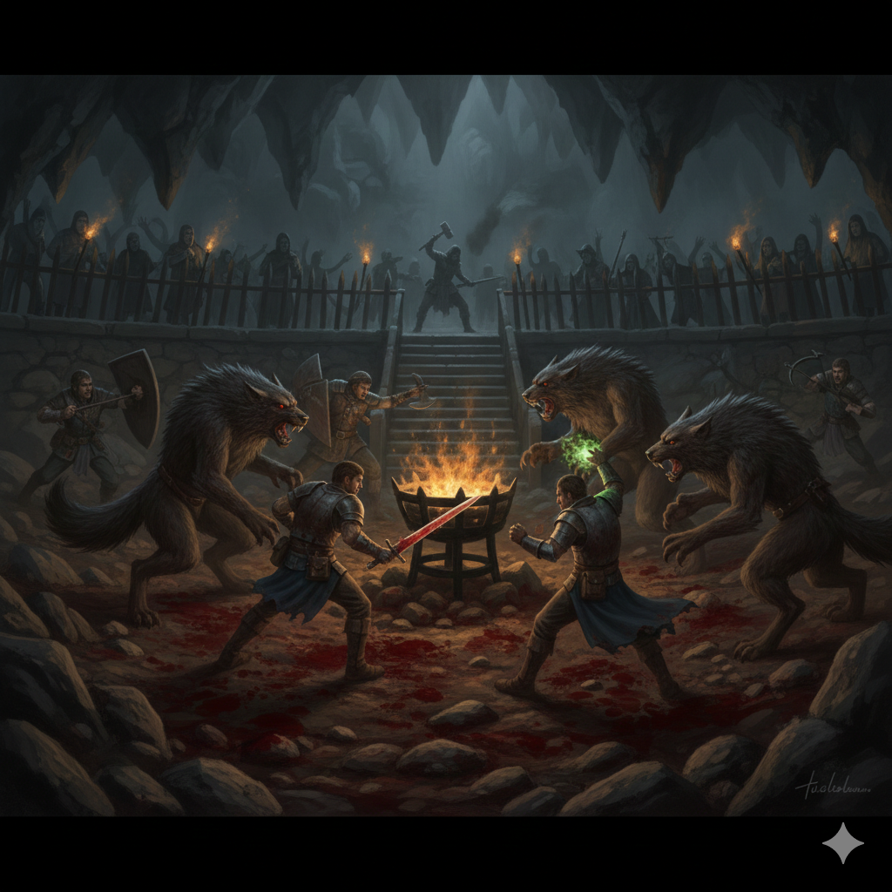

# Roster 

`INPUT[inlineListSuggester(optionQuery(#Category/Player)):sessionRoster]`

## Absent

`INPUT[inlineListSuggester(optionQuery(#Category/Player)):sessionAbsent]`

# Session Overview

This session was dominated by a massive, grueling combat encounter in the hidden Werewolf Den arena. 

## The Narrative

### Chaos in the Fighting Ring
The party, having infiltrated the hidden arena where abducted children were being forced to fight to the death, decided to intervene immediately. Nirthar initiated the combat by dropping a *Darkness* spell squarely into the middle of the arena, plunging the gruesome initiation ritual into utter chaos. 

All hell immediately broke loose. The ensuing fight was long, brutal, and physically taxing. Nirthar retreated to the edges of the conflict, acting as a stealth archer. Striking from the shadows, he managed to land devastating shots, claiming the lives of several werewolves throughout the encounter. 

### The Price of Blood
Tildrak took the brunt of the frontline assault, absorbing massive amounts of damage before finally going down under the ferocious onslaught, though the party eventually managed to heal him back to his feet. During the desperate melee, Borgür suffered a severe, deep bite on his healthy, normal hand from one of the beasts, resulting in him being infected with **lycanthropy**.

Despite the overwhelming odds, the party managed to successfully slay five full-fledged werewolves, as well as an old werewolf maintaining the fireside. However, the grueling fight had taken a severe toll. When the remaining five werewolves tacticaly retreated into their sleeping grotto, the party realized they were far too weak and drained of resources to pursue them. The difficult decision was made to retreat and survive. Before fleeing the area, the party severed and collected the heads of the five slain werewolves.

### Loot, Loss, and Erratic Allies
In the chaos of the battle, the party managed to save one of the children from the arena floor. Tragically, the terrified child bolted into the surrounding woods in a panic, only to be recaptured by a werewolf waiting outside. The party also grimly secured the bodies of the three children who had died in the arena during the fight, taking the tragic burden with them as they fled.

While the party bled in the dirt and fought for their lives, Ezmerelda d'Avenir was acting highly erratically. Instead of fully committing to the fight alongside them, she was frantically searching the area. She managed to recover a "lost heirloom" (the nature of which remains a mystery) alongside an unknown cursed treasure. In a final act of localized destruction, she smashed and set ablaze the shrine dedicated to the Night Mother. 

Not to be left out of the looting, Vinarius also claimed a concerning prize from the den: a cursed chalice, the dark effects of which are still unknown to him.

## The Facts
*   **Killed:** 5 standard werewolves, 1 old werewolf (fireside). The old werewolf was not looted.
*   **Condition:** The party is exhausted, hovering at low HP, with depleted spell slots.
*   **Afflictions:** Borgür is infected with Lycanthropy.
*   **Loot:** 5 werewolf heads, and Vinarius obtained a cursed chalice.
*   **NPC Actions:** Ezmeralda recovered her lost heirloom, stole a cursed treasure, and burned the Night Mother altar.
*   **Casualties/Captives:** 3 children perished in the arena fight (the party recovered their bodies). One child was temporarily saved but ran away and was recaptured by a werewolf in the woods. 
*   **Retreat:** The party fell back into the woods while the 5 surviving werewolves retreated to their sleeping grotto.

## Open Questions
*   How will the party cure Borgür's Lycanthropy before the next full moon?
*   What exactly is Ezmeralda's "lost heirloom" and what is the cursed treasure she took?
*   What curse is attached to Vinarius's new chalice?
*   Will the party attempt to rest and pursue the 5 surviving werewolves, or will they cut their losses and return to Krezk?
