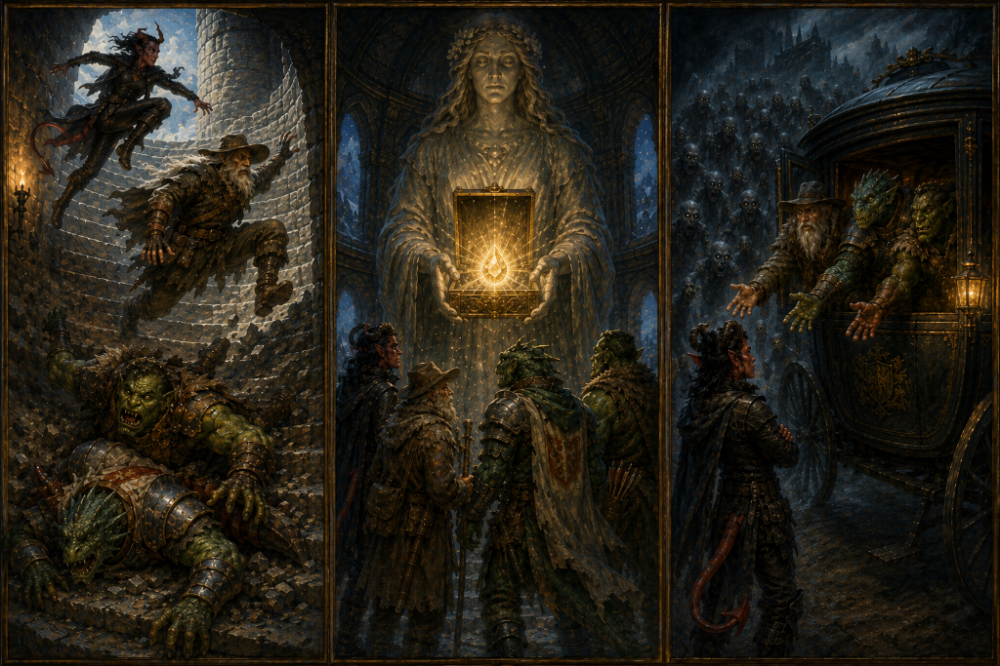

# Roster 

`INPUT[inlineListSuggester(optionQuery(#Category/Player)):sessionRoster]`

## Absent

`INPUT[inlineListSuggester(optionQuery(#Category/Player)):sessionAbsent]`

# Session Overview

## The Narrative
Standing in the ruined throne room, the party was subjected to a menacing monologue from the revenant commander, Vladimir Horngaard. He made his twisted logic abundantly clear: he despised Strahd so deeply that he wanted the vampire to suffer eternally. Therefore, if the party's goal was to kill Strahd—thus granting him the mercy of death and ending his suffering—Vladimir would view them as allies of the Devil and cut off their heads without hesitation. He also dropped a cryptic hint, claiming that the true source of this evil was located deep within the mountains. Not eager to engage the towering undead knight, the party stalled for time, extracting what lore they could before deciding he was a dead end and quietly retreating.

Splitting their focus, Vinarius remained behind to conduct a ritual to detect strong magical sources within the castle. Meanwhile, the rest of the party explored the mansion's lower floors. They discovered a grand mausoleum bearing a draconic inscription: *"Here lie the bones and treasures of Argynvost..."*, with four empty alcoves where the dragon's remains should have rested. They also encountered the hazy, undead Sir Godfrey Gwilym, who provided fragmented pieces of the castle's history in his brief moments of lucidity. 

Further up, Tildrak inspected a large stone gargoyle shaped like a dragon wyrmling. As he approached, its jaw ground open, blowing a massive cloud of smoke directly in his face before whispering a riddle: *"When the dragon dreams its dream, Within its rightful tomb, The light of Argynvost will beam And rid this land of gloom."* 

Down below, Vinarius finished his ritual. He sensed powerful transmutation magic emanating from the highest tower, and also learned that his mysterious cursed chalice was specifically tied to both darkness and vision. 

Attempting to reach the high tower proved disastrous. Tildrak slipped on the treacherous ascent and plummeted flat on his face. Borgür, overestimating his own agility, crashed entirely through the crumbling marble stairs, landing directly on top of the prone paladin. Nirthar and Vinarius easily scaled the gap and secured a rope. To ensure he wouldn't fall again, Tildrak undid his heavy chainmail armor, climbed the rope, and then hauled his armor up after him.

At the top, they found the source of the immense magic: a petrified statue of the warrior-priestess Lugdana, gripping a small box. Vinarius hubristically attempted to brute-force the magical seal, resulting in a spectacular failure that left him with a severe "magical hangover" (-1 to his Wisdom modifier until his next long rest). Fortunately, a draconic plaque on the statue instructed them to seek out the noble Sir Godfrey for the "words of Atonement." They returned to Godfrey, and by mentioning Lugdana's name, pierced his undead confusion. He entrusted them with the prayer he had never been able to say to her in life. Armed with his words, the party returned to the statue and recited the message. The stone hands parted, and the box sprung open.

Inside lay the **Tear of the Sun** (The Holy Symbol of Ravenkind). Without hesitation, they pressed the artifact to Borgür's festering bite wound. A warm, radiant glow washed over the Orc, instantly curing his lycanthropy. Excited by this success, they experimented further: the Tear had no effect on Borgür's phantom hand, but when pressed against Tildrak's "Mark of Atonement," the scar vanished completely! The artifact successfully severed Tildrak's connection to the Dark Power he had mistakenly believed was his god.

Their victory was almost short-lived. Descending to leave and cure little Jasper, they decided Nirthar—being the most stealthy—should scout ahead. Unfortunately, the rogue tripped dramatically on the stairs, crashing directly into a set of armor stands. The immense ruckus triggered an alarm, drawing every revenant in the castle. 

Choosing survival over valor, the party sprinted for the front doors. Bursting outside, they found a suspicious, driverless magical carriage waiting for them like a getaway car, its door swinging open invitingly. Vinarius, Tildrak, and Borgür leaped inside instantly. Nirthar rapidly calculated the odds of a trap versus the approaching horde of revenants, and reluctantly jumped in after them. 

The door slammed shut. The locks clicked. As panic set in, a holographic projection of Strahd von Zarovich flickered into existence within the carriage. Impeccably polite, the vampire lord explained he had a terrible problem only they could solve: Ireena was being difficult, and he desperately needed their help planning the catering and dress for their upcoming wedding.

## The Facts
*   **Encounters:** Avoided a fight with Vladimir Horngaard through dialogue. Escaped a massive revenant ambush after Nirthar spectacularly failed a stealth check and crashed into armor stands.
*   **Loot & Artifacts:** The party successfully retrieved the **Holy Symbol of Ravenkind** ("The Tear of the Sun") from the statue of Lugdana by using Sir Godfrey's prayer.
*   **Cures:** Borgür's corrupted lycanthropy was instantly cured using the Tear of the Sun. Tildrak's "Mark of Atonement" was completely cleansed, severing his link to the Dark Powers.
*   **Clues Discovered:** 
    *   Vladimir mentioned the source of evil is in the mountains (Amber Temple).
    *   The party found Argynvost's empty mausoleum.
    *   The Gargoyle whispered a cryptic riddle hinting that the light of Argynvost will only beam when "the dragon dreams its dream within its rightful tomb".
*   **Level Up:** The party has reached **Level 6**!
*   **Status Effects:** Vinarius suffers a -1 Wisdom modifier until his next long rest.
*   **Cliffhanger:** The party is currently trapped inside Strahd's magical, autonomous getaway carriage. Strahd (via hologram) has requested their assistance in planning his wedding to Ireena.

## Item Unlocked: Holy Symbol of Ravenkind
*Wondrous item, legendary (requires attunement by a cleric or paladin of good alignment)*  

The Holy Symbol of Ravenkind is a unique holy symbol sacred to the good-hearted faithful of Barovia. It predates the establishment of any church in Barovia. According to legend, it was delivered to a paladin named Lugdana by a giant raven—or an angel in the form of a giant raven. Lugdana used the holy symbol to root out and destroy nests of vampires until her death. The high priests of Ravenloft kept and wore the holy symbol after Lugdana's passing.

The holy symbol is a platinum amulet shaped like the sun, with a large crystal embedded in its center.

The holy symbol has 10 charges for the following properties. It regains `1d6 + 4` charges daily at dawn.

**Hold Vampires**
As an action, you can expend 1 charge and present the holy symbol to make it flare with holy power. Vampires and vampire spawn within 30 feet of the holy symbol when it flares must make a DC 15 Wisdom saving throw. On a failed save, a target is paralyzed for 1 minute. It can repeat the saving throw at the end of its turns to end the effect on itself.

**Turn Undead**
If you have the Turn Undead or the Turn the Unholy feature, you can expend 3 charges when you present the holy symbol while using that feature. When you do so, undead have disadvantage on their saving throws against the effect.

**Sunlight**
As an action, you can expend 5 charges while presenting the holy symbol to make it shed bright light in a 30-foot radius and dim light for an additional 30 feet. The light is sunlight and lasts for 10 minutes or until you end the effect (no action required).

## Open Questions
*   How will the party react to Strahd's bizarre wedding requests while locked in his carriage?
*   Where is the carriage taking them? 
*   Will they still be able to cure Little Jasper of his lycanthropy in time?
