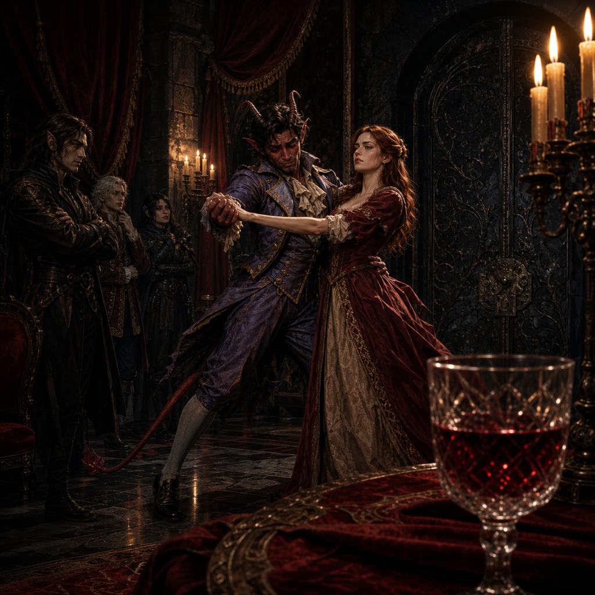

# Roster

`INPUT[inlineListSuggester(optionQuery(#Category/Player)):sessionRoster]`

## Absent

`INPUT[inlineListSuggester(optionQuery(#Category/Player)):sessionAbsent]`

Tildrak's player was absent, but Tildrak remained with the party and participated as a character.

# Session Overview

## The Narrative

### The Road to Ravenloft

Still locked inside Strahd's luxurious, driverless carriage, the party raced across Barovia at an unnatural speed. They passed Lake Baratok—and the road toward Rudolph van Richten's tower, where Little Jasper was still waiting to be cured—before flying past Vallaki, the nearby Vistani encampments, the Village of Barovia, and finally up the narrow mountain road toward Castle Ravenloft.

Rather than approaching the grand entrance, the carriage circled around the castle and entered a rear service courtyard containing stables, storage buildings, and a servants' entrance. The gate opened by itself, the carriage stopped, and its door unlocked.

The party stepped into the bitter cold and was greeted by an unnerving vibration, a piercing whine, and distant screams. Waiting near the servants' door were a tall, grey dusk elf and a hunched mongrelfolk servant. The elf furiously informed the party that they were late before introducing himself as Rahadin, Strahd's adopted brother and chamberlain.

Rahadin explained that the party was protected by guest right for as long as they behaved themselves. He also made it clear that he had already slaughtered entire families to ensure the wedding proceeded smoothly and would happily add the adventurers to that list.

### Guest Right and Hidden Sunlight

Strahd required the party's help because the castle staff had little understanding of human taste and Ireena had proven "difficult." Their first assignment was to design a five-course wedding menu for roughly thirty guests with the castle cook, Wormwiggle.

Before they could enter the kitchen, Rahadin ordered Cyrus Belview to search them. Cyrus confiscated the party's weapons, spellcasting equipment, alchemist's fire, and anything else larger than a fist, locking everything inside a chest mounted on a small trolley.

Nirthar, however, used his *Mage Hand* and a convincing distraction to keep the Holy Symbol of Ravenkind—the Tear of the Sun—hidden from Cyrus. The party entered Castle Ravenloft largely disarmed, but not entirely without protection.

### The Baron's Four Hands Plus One

The kitchen resembled a diseased greenhouse. Expensive plants grew beside mouldering animal carcasses, green magical flames burned beneath enormous cauldrons, and a foul stew bubbled nearby. The ingredients laid out on the worktable were expensive and mostly appeared fit for human consumption, although the origin of several cuts of meat was best left unquestioned.

Wormwiggle, a cheerful and deeply unsettling old cook, welcomed the party and explained the proposed five courses: a reception bite, soup, two main courses, and dessert. Rather than simply cooking, she challenged them to a card game called **The Baron's Four Hands Plus One**. Each round represented one course. A victory allowed the party to slip a helpful and potent ingredient into the food, while a defeat gave Wormwiggle the opportunity to hide something considerably less helpful inside it.

The official results were:

*   **Reception Bite:** Draw. The recipe remained largely neutral.
*   **Soup:** Loss. Wormwiggle may have added something dangerous while the party was distracted.
*   **First Main Course:** Victory. The party successfully added a beneficial ingredient intended to help them during the wedding.
*   **Second Main Course:** Loss. Wormwiggle again had an opportunity to sabotage the dish.
*   **Dessert:** Victory. A second beneficial ingredient was successfully included.

An extra round was played to decide the drinks, but it ended poorly. When Nirthar tried to palm one of Wormwiggle's cards, she swung a cleaver at his hand. He pulled his fingers away just in time and escaped with all ten still attached.

The final menu therefore contained two courses the party trusted, two they considered suspicious, and one uncertain opening bite. Their future selves—and Ireena—would need to choose carefully at the wedding feast.

### An Intentionally Terrible Dance

Before the party could leave the kitchen, an enraged Rahadin stormed inside with a change of plans. Ireena had apparently whispered to Strahd that his preferred dance was outdated. Strahd took the insult personally and demanded that the party teach her a modern dance from the Sword Coast so that he could learn it as well.

Rahadin led them through a concealed servants' corridor and up an exhausting spiral staircase spanning six levels. At the top, he unlocked a richly decorated metal door leading into Ireena's comfortable but windowless prison chamber.

Nirthar volunteered to demonstrate the dance. As soon as Ireena took his hand, she whispered that he should deliberately make a mess of it. Nirthar obliged, dancing badly and blaming the grim, old-fashioned music, his clothing, and the pressure of being watched. With Ireena's support, he convinced Rahadin that they required two hours of privacy to prepare a proper performance.

Rahadin reluctantly agreed, but promised that failure would result in the party being grated into parmesan for the wedding meal. He locked the door behind him.

### Red Dragon Crush

The moment Rahadin left, Ireena dropped the act. She was relieved that the party had finally reached her and demanded to know how they planned to free her. The party admitted that their arrival had been accidental, but promised they would not allow the wedding to proceed. Ireena declared that she would rather die a thousand deaths than marry Strahd.

They agreed that the wedding—scheduled in approximately three weeks—would provide the best opportunity for a rescue. With friend and foe gathered in one place, the party could create enough chaos to reach Ireena and escape. Whether they should focus only on extraction or attempt to kill Strahd during the same operation remained unresolved.

To coordinate the moment everything began, they chose the phrase **"Red Dragon Crush."** If Ireena or any member of the party deliberately spoke the wine's name in context, it would mean that the plan had started and all hell was about to break loose.

Ireena also shared what she had learned about Castle Ravenloft:

*   Confiscated equipment is stored near the stables, in a room reachable from the service entrance.
*   The same area can be reached from the main dining hall through a concealed servants' passage beside a portrait of Strahd's mother.
*   The catacombs may offer another way into or through the castle, although Ireena has never explored them fully.
*   She has seen an enormous skull in the catacombs that may be the missing skull of Argynvost.
*   The castle is filled with animated armour, jellies, strange beasts, and possibly even wyrmlings.
*   Strahd appears able to control the castle itself, making ordinary escape plans dangerously unreliable.
*   A mistreated accountant named Lief also lives within the castle. Ireena does not truly trust him, but he appears to share some of her misery.
*   Anastrasya, one of Strahd's consorts, has designed a blood-red wedding dress for Ireena.

The party discussed gathering allies such as Fiona Wachter, Rudolph van Richten, Ezmeralda d'Avenir, and the revenants of Argynvostholt. Strahd intended to invite both allies and enemies from across Barovia, convinced that the wedding would be his magnum opus. That arrogance might provide the party with the army and distraction they needed.

### A Dance Worth Dying For

With their conspiracy established, Nirthar and Ireena used the remaining time to rehearse an actual dance. Guided and encouraged by the others, Nirthar performed well enough for Ireena to approve.

Rahadin returned exactly as promised and presented Nirthar with a strange cloth suit that would allow Strahd to learn the choreography through animation magic. Despite the uncomfortable outfit, Nirthar and Ireena completed a convincing demonstration. Rahadin, who openly admitted that he understood nothing about dancing, decided it looked acceptable.

The party was given a pouch of gold for its work and informed that the wedding dress code was simply their "absolute best"—something comparable to a black-tie gala. Rahadin then escorted them back down the servants' stairs, leaving Ireena behind to practise alone.

### Strahd's Seating Plan

At the bottom of the staircase, the party heard Strahd questioning Rahadin about the unfinished invitation list. The vampire lord appeared in person, impeccably dressed and already occupied with the wedding's next logistical crisis.

When Rahadin struggled to remember who currently ruled Vallaki, the party helpfully supplied Fiona Wachter's name. Strahd immediately concluded that the adventurers understood Barovian politics better than his chamberlain and instructed Rahadin to outsource the seating arrangement to them.

The party was brought to a planning table near the grand dining hall. A head table and five round guest tables had been drawn out beside a long list containing allies, enemies, former acquaintances, castle residents, political figures, and several names the party barely recognized. Strahd's only instruction was that obvious enemies should not be seated together, as he wanted the celebration to remain friendly.

The session ended with the party staring at the guest list and realizing that arranging the tables might also allow them to arrange the battlefield.

## The Facts

*   **Castle Ravenloft:** The party is inside Castle Ravenloft under conditional guest right and entered through the rear servants' entrance beside the stables.
*   **Attendance:** Three players attended. Tildrak's player was absent, but Tildrak remained with the party as a character.
*   **Disarmed, Mostly:** Cyrus confiscated the party's equipment and stored it near the stables, but Nirthar successfully concealed the Holy Symbol of Ravenkind.
*   **The Menu:** The reception bite was neutral; the soup and second main course may be sabotaged; the first main course and dessert contain beneficial ingredients placed by the party.
*   **The Wedding:** Strahd and Ireena's wedding is planned for approximately three weeks from now.
*   **The Signal:** "Red Dragon Crush," deliberately spoken in context by Ireena or one of the four adventurers, is the agreed code phrase that begins the rescue operation.
*   **Castle Intelligence:** The party learned the location of its gear, the existence of a concealed servants' route from the dining hall, a possible catacomb entrance, and the likely location of Argynvost's skull.
*   **Potential Contact:** Lief, Strahd's abused accountant, may share Ireena's desire to escape the castle, although she does not consider him trustworthy.
*   **Payment:** The party received a pouch of gold for its wedding-planning work.
*   **Little Jasper:** The magical carriage passed Lake Baratok without stopping. Little Jasper remains at Rudolph van Richten's tower and has not yet been cured.
*   **Current Assignment:** Strahd has ordered the party to arrange the wedding's five guest tables without placing obvious enemies together. The seating plan has not yet been completed.

## Open Questions

*   Can the party use the seating plan to position allies and enemies in preparation for the wedding ambush?
*   Who among Strahd's enormous guest list can truly be trusted to help rescue Ireena?
*   Will the party attempt to kill Strahd at the wedding, or focus on escaping with Ireena first?
*   Can they recruit Van Richten, Ezmeralda, Fiona, the revenants, and their other scattered allies within three weeks?
*   How will they recover their confiscated equipment and retrieve Argynvost's skull from the catacombs?
*   Can they return to Lake Baratok and cure Little Jasper before his lycanthropy progresses?
*   What exactly did Wormwiggle place inside the soup and second main course?
