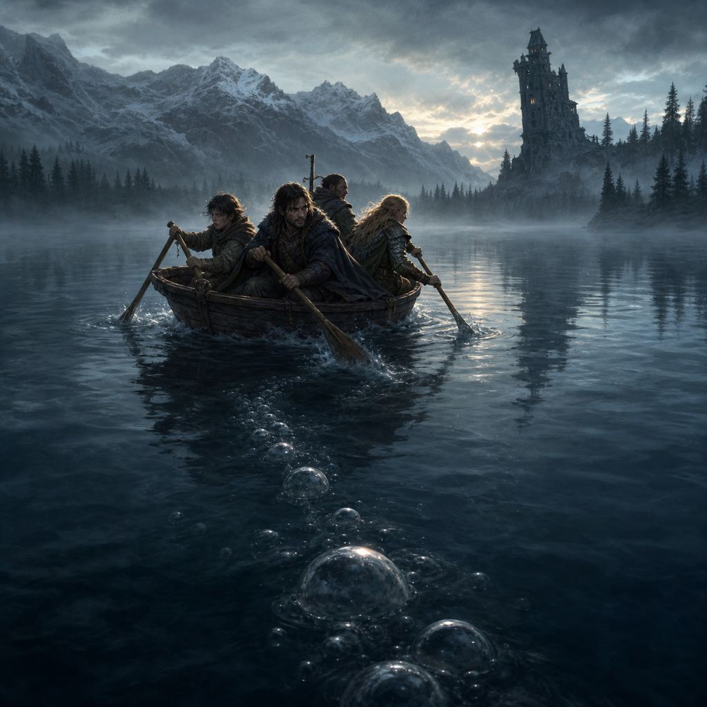

# Roster

`INPUT[inlineListSuggester(optionQuery(#Category/Player)):sessionRoster]`

## Absent

`INPUT[inlineListSuggester(optionQuery(#Category/Player)):sessionAbsent]`

Vinarius, Tildrak, and Nirthar's players attended. Borgür remained with the party as a character, but no player voice for Borgür appears in this partial transcript.

# Session Overview

## The Narrative

### A Wedding Feast Set for War

The party resumed its work over Strahd's immense wedding guest list. What appeared to be an exercise in etiquette remained a rehearsal for violence: every chair might place an ally within reach, an enemy at someone else's throat, or an innocent in the path of the coming chaos.

As the adventurers sorted the names, Rahadin supplied introductions with the casual cruelty of a man reciting a household inventory. The wounded dusk elf was **Kasimir Velikov**. Rahadin suggested seating him near the Vistani—his people's jailers and supposed protectors—then proudly revealed that he had personally cut off Kasimir's ears and still wore the pair on a chain. Strahd's revenge, Rahadin added, had robbed Kasimir's entire people of their future.

Yet Rahadin's answer felt deliberately incomplete. He offered the punishment as a taunt, not an explanation, leaving the party without the act that provoked it or the true meaning of a people being robbed of their future. Whatever lies between Rahadin, Kasimir, Patrina, and Strahd is a story Rahadin was not willing to tell in full.

Another card bore the name **Patrina Velikovna**, Kasimir's dead sister. Death had not removed her from Strahd's plans: Rahadin placed Patrina at the high table alongside Strahd's household. Ludmilla, Sasha, Volenta, Vasilka, and Rahadin were likewise assigned places there. Elsewhere, the party tried to separate obvious rivals, keep Vallaki's deposed Vallakoviches away from Fiona Wachter, seat children together, place Urwin among the ravens, and arrange the werewolves, Vistani, dusk elves, clergy, nobles, hunters, and allies without starting the bloodshed before the vows.

They also positioned themselves with an eye toward the battle they expected the wedding to become. Vinarius wanted a seat close enough to speak with the winemaker, while the group divided itself among friendly tables rather than gathering in one obvious conspiratorial knot. By the end, the chart was crowded, imperfect, and complete enough to satisfy their assignment. Strahd would have his feast. The party intended to make the seating useful when **Red Dragon Crush** was finally spoken.

### Three Minutes of Guest Right

The adventurers were directed back through the kitchen and servants' entrance toward the rear courtyard. Cyrus Belview waited beside Strahd's carriage, but the party refused to leave without the equipment he had confiscated. While Cyrus went to fetch the chest, they searched the courtyard, storage room, stables, and the ancient outer wall for anything that might aid a later infiltration.

The storage room held only hay, grain, and mundane supplies. In the stable, Tildrak found a nightmare—a skeletal horse wreathed in fire. Approaching it brought on an intense headache and made the creature restless, so he wisely withdrew. The stable's drainage was far too small to serve as a secret entrance, but Vinarius found loose stones low in Ravenloft's massive wall. Beneath one of them he hid a flask for a future visit and marked the stone with a cluster of grapes.

Cyrus returned with the locked chest and announced that only three minutes of guest right remained. The party recovered everything it had surrendered; nothing appeared to have been taken or disturbed. Nirthar briefly considered casting *Sleep* on Cyrus, while Tildrak tried to determine whether the mongrelfolk servant was undead. His divine sense did not yield a clean answer. Instead, Strahd's presence seemed to coil through the castle grounds and press into Tildrak's mind, asserting Ravenloft as the vampire's domain. Cyrus's patchwork body included a strange, apparently dead reptilian appendage, but the party could not determine his true nature. Rather than risk their remaining protection, they abandoned the spell and boarded the carriage.

### The Carriage's Sweet Breath

The party told Diego, the spirit bound to the carriage, to take them to Van Richten's Tower. The door sealed behind them. Cabinets refused to open, the window would not break, and sweet-smelling purple smoke began to fill the compartment. One by one—despite protests, braced weapons, and attempts to stay beneath the fumes—the adventurers lost consciousness.

They awoke after an unknown span of time on a cold, mist-covered shore of Lake Baratok. Dawn was only beginning to lighten the sky. The carriage had vanished, and Van Richten's tower stood on the far side of the silent lake. Whatever Strahd's transport had done to them, the enforced sleep had at least granted the party a long rest.

Vinarius warmed the group with magic and then revealed an absurdly timely resource: his *Robe of Useful Items* still carried a patch capable of becoming a small boat. The patch transformed into a vessel the party variously described as a canoe, rowboat, dragon-shaped pedalo, and giant rubber duck. Ridiculous or not, it floated. Vinarius and Borgür propelled it across the water while the others balanced the craft and kept watch.

### Something Beneath Baratok

At the centre of the lake, far from either shore, large bubbles broke the glassy surface. They did not remain still. When the boat adjusted course, the disturbance followed, slowly but relentlessly closing the distance. The party paddled harder, readied weapons and magic, and watched the water for whatever was hunting them. Just before the bubbles reached the hull, they vanished.

The danger had not gone. Bread cast onto the lake was abruptly sucked beneath the surface. Nirthar used *Mage Hand* to throw a ration away from their route, and that offering disappeared as well. With Vinarius's *Guidance* urging on the paddlers, the party drove the little boat toward the tower and finally splashed through the knee-deep water at the shore. Once everyone was safely clear, Vinarius gave their single-use vessel a Viking funeral and burned it rather than leave it drifting behind them.

### Back to the Hunters

The leaning tower remained standing through magic and stubbornness. When the party reached its front door, Ezmeralda d'Avenir answered. Their first question concerned Little Jasper. Ezmeralda reported that the boy was doing well, and the adventurers eagerly announced that they had returned with the Tear of the Sun to save him.

Inside, Rudolph van Richten—still referred to in passing by his Rictavio alias—looked up from his books and demanded to know how their confrontation with the revenants had ended. The party offered the condensed truth: they had obtained the Tear, been abducted by a carriage, and ended up before Strahd. Van Richten asked to inspect the relic. Although Vinarius insisted that Jasper's cure came first, Nirthar allowed the hunter to examine it. Van Richten studied the holy symbol with wonder, compared it against his notes, and began to understand how it connected to the documents and clues he had previously shared with them.

The Tear was then used on Little Jasper. Its radiance cleansed the corrupted lycanthropy from the boy, leaving him cured and ready to be returned safely to Krezk.

The hunters then asked how the party had overcome Vladimir. The adventurers admitted that Vladimir had not been helpful at all; someone else had supplied the crucial words, and their eventual departure from Argynvostholt had been considerably more like a desperate flight.

### Too Many Errands for One Hunter

The conversation turned into a division of labour for the coming wedding. Little Jasper still needed to be returned safely to Krezk. At the same time, someone needed to approach Vladimir Horngaard and convince the revenant commander to come to Castle Ravenloft, where his hatred and his knights could cause a formidable ruckus during Strahd's wedding.

The party initially attempted to place both burdens on Ezmeralda d'Avenir. She appeared to agree, but her sarcasm sharpened with every added request until she asked whether they would also require a foot rub afterward. The debate continued until Rudolph van Richten intervened and imposed a more workable arrangement: Ezmeralda would handle Vladimir, while Van Richten would take responsibility for bringing Little Jasper back to Krezk.

That left the adventurers with the task that only they and their relic could attempt. They would return to the dark portal beneath Yester Hill and enter the realm of the Huntress. The vision they received there long ago had told them to return only once they possessed the **power of the sun**. With the Tear of the Sun now in their hands, the old warning had become a path forward.

### The Old Raven Returns to Yester Hill

The road to Yester Hill first took the party back to the Wizard of Wines winery to catch up with the Martikovs and ask for help. There they appealed to **Davian Martikov**, the winery's elderly patriarch and the wereraven who had first sent them to recover his family's stolen gem from Yester Hill.

The party persuaded Davian to join the expedition. The old wereraven accompanied them toward the site where Wintersplinter had once been summoned in Strahd's honour. Urwin remained in Vallaki, where his history with the party is still scarred by the bloody jailbreak massacre.

### Where the Sun Does Not Move

At Yester Hill, the party returned to the dead Gulthias Tree and the portal that had maimed Borgür. The first time they found it, the Huntress had warned them that they would need the power of the sun to survive her place of worship. Borgür had ignored that warning and thrust his hand through the darkness. Within seconds, his hand withered and crumbled to dust, leaving the party with terrible proof that crossing the threshold without the promised radiance was lethal.

Now the party carried the Tear of the Sun. Bearing the promised radiance, the adventurers and Davian crossed the threshold together.

Beyond it lay a cavernous expanse caught in a single, unchanging instant. Nothing stirred. At its centre burned a campfire—one of the only things in the realm that still moved. Beside the flames sat a hooded woman, silent and ominous against a world from which time itself seemed to have withdrawn.

There, before anyone could learn whether the figure was the Huntress, a guardian, or something worse, the session ended.

## The Facts

*   **Attendance:** Vinarius, Tildrak, and Nirthar's players attended. Borgür remained with the party as a character.
*   **The Seating of Knives:** The party completed Strahd's wedding seating plan and divided itself among friendly tables. Rahadin identified Kasimir as the wounded elf, claimed to wear his severed ears, and alluded to Strahd robbing his people of their future without telling the full story. Kasimir's dead sister Patrina was assigned a place at the high table.
*   **Leaving Ravenloft:** The party recovered all its confiscated equipment and left without breaking guest right. Vinarius hid a flask beneath a grape-marked stone in the courtyard for a future return.
*   **Across Lake Baratok:** Purple gas inside Strahd's carriage forced the party into a long rest before abandoning them across the lake from Van Richten's tower. Vinarius expended and later burned a boat from his *Robe of Useful Items* while something unseen pursued them beneath the water.
*   **Jasper Cured and Work Divided:** The Tear of the Sun cured Little Jasper's corrupted lycanthropy. Van Richten agreed to return him to Krezk, while Ezmeralda would try to recruit Vladimir and his revenants to disrupt Strahd's wedding.
*   **Davian Recruited:** At the Wizard of Wines, the party persuaded Davian Martikov to join the expedition to Yester Hill. Urwin remained in Vallaki.
*   **The Power of the Sun:** The party recognized the Tear of the Sun as the radiance the Huntress had told them to bring. Together with Davian, they crossed the portal that had destroyed Borgür's hand in Session 7.
*   **Cliffhanger:** The party ended inside the motionless realm beneath Yester Hill, facing a burning campfire and the hooded woman seated beside it.

## Open Questions

*   Why did Strahd rob Kasimir's entire people of their future, and what does that phrase truly mean?
*   What part of Kasimir and Patrina's history was Rahadin deliberately withholding?
*   Can Ezmeralda convince Vladimir to set aside his opposition and bring the revenants to Strahd's wedding?
*   Will Van Richten and Little Jasper reach Krezk safely?
*   What role will Davian play in restoring the Huntress, and will the expedition change his plans for opposing Strahd?
*   Is the hooded woman beside the campfire the Huntress, and why are she and the flame able to move in the frozen realm?
*   What must the party do to restore the Huntress and break the power Strahd stole from her?
*   What was moving beneath Lake Baratok, and did burning the boat attract or destroy anything?
*   Will Vinarius's hidden flask remain undisturbed beneath the grape-marked stone at Ravenloft?
*   Will the party's final seating arrangement survive Strahd's scrutiny and give its allies an advantage at the wedding?
*   Why was the dead Patrina Velikovna given a seat at the high table, and how is her fate connected to Kasimir's punishment?
*   What exactly did Tildrak sense when Strahd's presence overwhelmed his divine perception in the courtyard?
