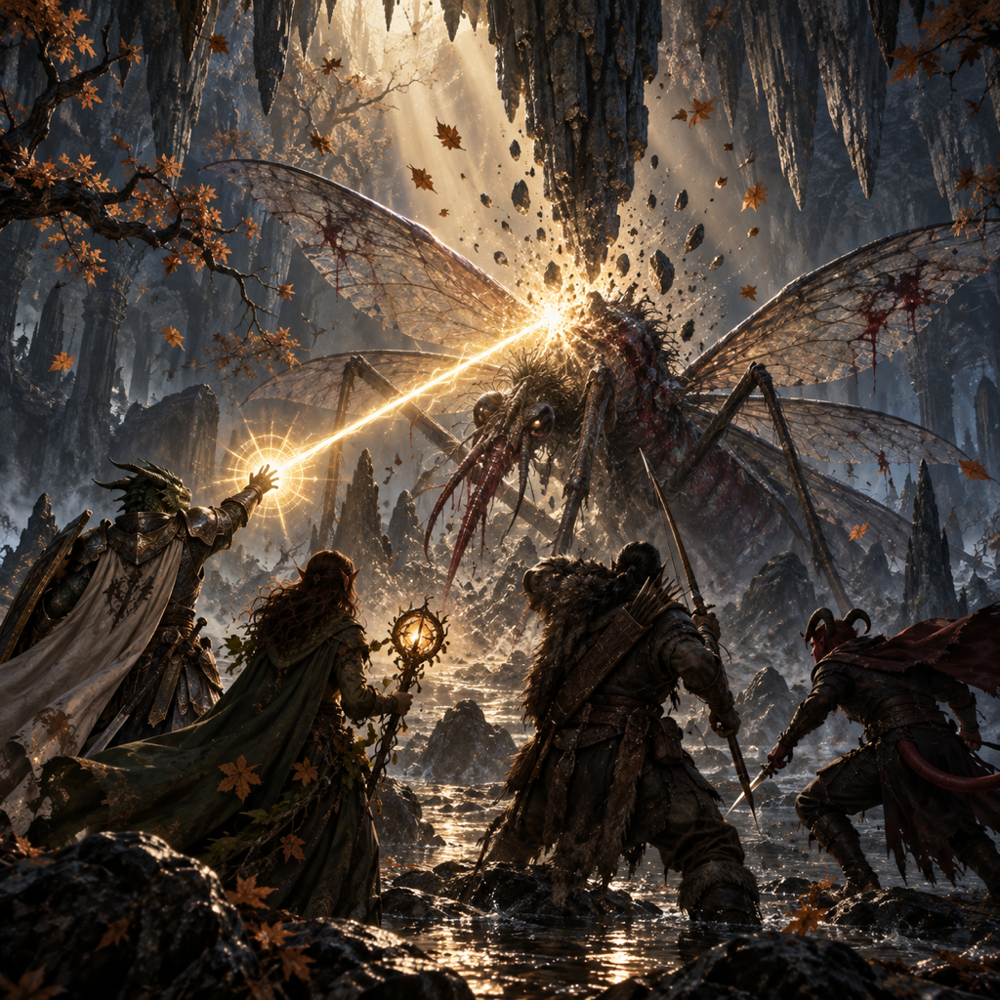

# Session Overview

## The Narrative

### The Sun Reminds the World to Move

Beyond the portal beneath Yester Hill, the party and Davian Martikov stood in an immense cavern abandoned by time. Autumn leaves hung motionless between twisted trees. Stalactites waited high overhead. There was no road onward and no visible exit but the portal behind them. Only the distant campfire still moved, its flame burning beside a hooded woman bent silently toward the heat.

The Tear of the Sun blazed more fiercely here than it had in Barovia. Its light reached roughly thirty feet around Vinarius, and within that radiance the realm remembered how to move: a suspended leaf fell when the light touched it. The party advanced together, unwilling to stray far beyond that small island of living time.

When the Tear reached the campfire, the flames rose and the woman stirred. The apparent peace fractured. Black veins showed beneath her deathly skin, and red power pulsed through them as though being drawn away with every heartbeat. For one instant the cavern revealed another truth occupying the same place: the hooded woman was a towering, broken figure pinned by a black spike, while an enormous four-winged fiend fed upon the wound through its needle-like proboscis.

The vision vanished, returned, and finally tore open. The creature pulled its proboscis free with a wet sucking sound as stolen red power flowed into its swollen abdomen. The Huntress warned the party to remain in the light and not let the fire die. Then the wings began to drone, and Lord Vzz'kral attacked.

### The Keeper of the Stolen Hour

The fight ranged across two overlapping realities. Beyond the Tear's radiance, cold and creeping temporal decay bit into anyone who lingered too long. Vinarius answered with repeated castings of *Moonbeam*, keeping radiant light upon Vzz'kral as the fiend swept through the cavern. Tildrak kindled his sword with Sacred Weapon and placed himself between the demon and his companions. Borgür marked the creature as his quarry, cut into its proboscis, and then kept firing as it took to the air. Nirthar used trees and stone as cover, harrying it with *Chill Touch* and ranged attacks whenever an opening appeared.

Vzz'kral fought by breaking the party's formation. Its wings hurled Vinarius away from the others. Violet miasma rose from the cavern floor and filled the eye with black spots. Necrotic darts wounded Vinarius and briefly prevented healing, while nearly invisible webbing spread between the trees. The fiend reshaped the stone itself, drawing a wall of stalactites down from the ceiling.

Worst of all, Vzz'kral drew the campfire into itself. The flames died without even an ember, and some of the demon's wounds closed. Oil and tinder could produce fire, but not the protective light the Huntress had commanded them to preserve. The party was left to the Tear's moving sanctuary.

The demon did not recover for long. Nirthar struck from hiding with *Whisperfang*, and the terrible psychic blow left Vzz'kral ruined: its four wings failed and its swollen reservoirs of stolen power collapsed. Vinarius's moonlight withered what remained. Unable to fly, the fiend dragged itself toward the shelter of the hanging stone.

Tildrak had been waiting for precisely that mistake. He loosed a readied *Guiding Bolt* into the stalactite above Vzz'kral. The stone fang broke loose and drove through the crippled demon, ending the Keeper of the Stolen Hour beneath the cavern ceiling it had tried to use as refuge.

### One of Strahd's Aces

With the fiend dead, Vinarius carried the Tear to the extinguished campfire and used *Produce Flame*. This time the wood caught properly. The Huntress lifted her head and declared that, after more than six hundred years, the creature draining her power was dead.

She told the adventurers what their victory meant. The black implantation had carried her power to Strahd. By killing Vzz'kral, the party had taken away one of the vampire's "aces": the regenerative power stolen from the Huntress and his supernatural communication with bats and werewolves would no longer serve him. She was certain Strahd had felt the loss.

The Huntress also revealed that two sisters remained in bondage. **The Weaver** lay in the swamps of Berez and governed memories, magic, and false history. **The Seeker** was hidden in the heights of Tsolenka Pass and concerned herself with the future, prophecy, and ravens. Their imprisonments were not necessarily entered through a portal like this one, and the Huntress offered no simple rite for finding or freeing them.

Yet the first Fane was not restored. Vzz'kral's death had ended the siphon, but the black spike still passed through the Huntress in the frozen layer of the cavern. She could not leave while it held her.

### Fifteen Years for Freedom

The Huntress warned them before anyone touched the spike. Removing it would take fifteen years within the frozen realm and cost that same span from the bodies of every creature still inside. She believed only about five days would pass beyond the portal, but warned that fewer hands would make the extraction slower and could cost still more time outside.

The wedding clock made the choice cruel. Leaving would preserve years of their lives but abandon the Huntress after they had already broken her jailer. Working alone would endanger the coming rescue at Ravenloft. The party considered fetching more helpers, using summoned strength, or placing only the longest-lived among them at risk. In the end, they stopped bargaining with the inevitable.

Together they seized the spike and pulled. Davian remained trapped in the realm with them and suffered the same cost, whether he welcomed it or not. Reality flickered without end. The labour felt like a dream stretched across an age: unbroken effort, then sudden waking. When awareness returned, the spike was free and every one of them had physically aged fifteen years.

The Huntress rose, whole at last. Falcon-like wings unfolded beneath her cloak. She thanked the adventurers, promised that she would need time to heal, and departed upward through another realm until nothing remained of her in the cavern.

### What the Prison Left Behind

The spike remained in the party's hands: a dark, ice-cold metal rod, unnaturally heavy until its nature was recognized. It was an Immovable Rod, capable of fixing itself in place when awakened by a small pulse of magic. The party kept it.

The webbing Vzz'kral had strung between the trees also retained its power. Direct contact sent one adventurer into sleep for roughly a minute. Using *Mage Hand* and a careful container, the party recovered one spool of the sleep-inducing web without touching it again.

With no further treasure to find, the adventurers and Davian passed back through the portal. They emerged beneath Yester Hill fifteen years older, with the first of the Ladies Three free and Strahd newly weakened. The exact date outside—and how much of the wedding countdown remained—had not yet been verified when the session ended.

## The Facts

*   **The Frozen Realm:** The Tear of the Sun created a roughly 30-foot radius in which frozen leaves and other parts of the cavern resumed moving. Leaving its protection exposed creatures to temporal cold and necrotic decay.
*   **The Bound Huntress:** The hooded woman was confirmed as the Huntress. The Tear revealed a second layer of reality in which a black spike transfixed her and Lord Vzz'kral fed through it.
*   **Lord Vzz'kral Slain:** The party destroyed the demon's wings and swollen reservoirs of stolen power. Tildrak killed the crippled Vzz'kral by breaking a stalactite loose with *Guiding Bolt* and impaling it beneath the falling stone.
*   **The First Fane Restored:** Killing Vzz'kral stopped the active siphon. The party then pulled the spike free, completely liberating the Huntress and advancing Restore the Land of the Ladies Three.
*   **The Price:** Vinarius, Tildrak, Nirthar, Borgür, and Davian each physically aged **15 years** while removing the spike. The Huntress estimated that roughly **5 days** would pass outside, but the party had not confirmed the external date by the end of the session.
*   **Strahd Weakened:** The Huntress said Strahd lost the regenerative power he had stolen from her and his supernatural communication with bats and werewolves. She was certain he noticed the loss.
*   **The Remaining Ladies:** The Weaver is in the swamps of Berez and is tied to memories, magic, and false history. The Seeker is hidden in the heights of Tsolenka Pass and is tied to the future, prophecy, and ravens.
*   **The Huntress Departed:** After being freed, the Huntress revealed falcon-like wings and left through another realm to heal.
*   **New Item:** The party recovered the black spike as an Immovable Rod.
*   **Recovered Material:** The party collected one spool of Vzz'kral's sleep-inducing web using *Mage Hand*. Direct contact with the web caused approximately one minute of sleep.
*   **Final Location:** The party and Davian ended just outside the Huntress's portal beneath Yester Hill.
