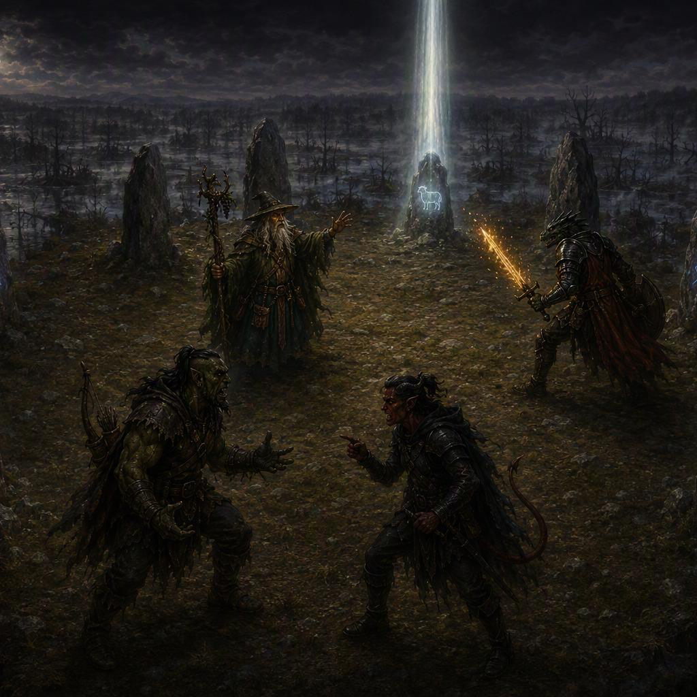

# Session 20 - What Was Falsely Written <small>· ~9 min read</small>

# Roster

`INPUT[inlineListSuggester(optionQuery(#Category/Player)):sessionRoster]`

## Absent

`INPUT[inlineListSuggester(optionQuery(#Category/Player)):sessionAbsent]`

The transcript records Vinarius, Tildrak, Nirthar, and Borgür acting during the session. No absence was stated.

# Session Overview

## The Narrative

### Five Days Later

The party emerged from beneath Yester Hill beneath the noonday sun. Fifteen years had settled into the bodies of the four adventurers and Davian Martikov, but Barovia had advanced by only five days. Twelve days remained before Strahd's wedding. Davian's first concern was not the lost years but the bitter discovery that his children had not aged with him; the fantasy of returning to find them old enough for tavern company and useful work vanished as quickly as it had formed.

When the party declared that they would seek the Weaver in the swamps of Berez, Davian agreed to guide them despite warning that those who entered the marsh did not return. He also confessed a second interest. Years ago, Baba Lysaga's scarecrows had attacked the Wizard of Wines and carried away one of the winery's gemstones toward Berez. If the party recovered it and wine could be made from it again, Davian promised Vinarius the right to name the restored vintage.

The party took the wagon east and used the journey to rest, prepare spells, read, and maintain weapons. Nirthar also counted the purse previously received from Strahd, though the transcript does not preserve the denomination and final division clearly enough to settle the party's accounts. After roughly six hours the ground became too sodden for the wagon, and the party continued into the mist on foot while Borgür used his familiarity with swampland to keep them on firm ground.

### The Blood Procession

Deep in the mire, three bowed silhouettes moved through the fog. Borgür scouted ahead and found three humanoid figures driving six gaunt, silent sheep. They were scarecrows, bound to Baba Lysaga's service, and they carried heavy vessels toward a fenced pen.

After the scarecrows departed, the party inspected the enclosure. Two large amphorae held thick sheep's blood, while the animals inside stood matted, exhausted, and unnaturally quiet. Vinarius began the ritual for *Speak with Animals*, but it was interrupted when Davian caught the scent of a familiar wereraven and touched the fence. Human skulls rose along its length and began to howl, their empty eyes flashing through the fog.

The alarm drew Muriel Vinshaw from hiding. She revealed herself as a wereraven of the Martikov family and urged everyone to flee before Baba arrived. Following her across a fallen tree and over the river, the party reached a circle of eleven ancient menhirs beyond the thickest mist.

### Three Lies upon the Stones

The stones bore weathered carvings of animals from across the natural world. Three newer arcane glyphs had been laid across those older images, each carrying illusion magic. The circle itself felt cut away from the outside world, as though no distant watcher could see within it.

Muriel told the common story that the river had swallowed Berez. Davian corrected her: the flood had not been natural. Strahd had drowned the village in revenge. At the spoken truth, one of the overlaid glyphs faded and a sound like a taut strand breaking passed through the circle. The glyph returned after several minutes, but its reaction revealed the prison's law: false history had to be answered with truth.

Muriel explained that she had come to watch Baba Lysaga with three companions and that the others had been captured. She knew Baba used sheep's blood in her rites but understood little about the menhirs or the Weaver. The party therefore crossed back into the drowned village in search of the history the swamp had buried.

Among the ruined foundations, mist gathered into the ghost of Lazlo Ulrich, Berez's former burgomaster. His body was gaunt and opened at the belly, the mark of Strahd's revenge. Ulrich confessed that Marina had been falling under the vampire's influence. To prevent her transformation and preserve her soul, Ulrich and the village priest killed her. Strahd answered by sending a great flood over Berez and later used bats to tear Ulrich open from within.

Nearby stood Marina's monument. Its stone face was the image of Ireena, another life caught in the same obsession. The monument named Marina as one “taken by the Mists,” a gentler epitaph than the death Ulrich described.

When the party returned to the menhirs and spoke what they had learned, a second illusion glyph died. Two truths were now known: Strahd had deliberately drowned Berez, and Marina had been killed by Ulrich and the priest to prevent her becoming a vampire. One lie remained.

### The False Mother

Searching for Muriel's captured companions brought the party at last to a hut walking slowly through the marsh upon colossal roots. Nirthar climbed to an open window and saw two living ravens in cages, a rocking cradle, and a woman crooning to the child within. The rest of the party climbed the moss-hung roots and approached openly.

Baba Lysaga welcomed the strangers into her home and offered them food. She called the child in the cradle “little Strahd” and spoke of the vampire's coming wedding as the marriage of her own son. She expected a mother's place of honor despite the party remembering no place for her on the seating plan. Her scarecrows, she explained, were preparing a blood bath so she might appear fresh for the occasion.

The party flattered Baba and kept her talking while they examined the cramped hut. She despised the caged ravens and sang of feeding them to the fire for the child's amusement. *Detect Magic* exposed the cradle's secret: the infant Strahd was only an illusion. The two ravens, meanwhile, were the captured wereravens the party sought.

Vinarius moved close to the cradle and dispelled the false child. As Baba's delight broke into fury and grief, Nirthar opened both cages. The wereravens flew free, and the party scrambled down the roots and fled through the swamp while Baba wailed the same claim over and over: she was Strahd's mother, and Strahd belonged to her.

### What Was Falsely Written

The party reached the standing stones safely. The rescued wereravens resumed human form and were identified as Gilbert and Susanne. Both were alive but badly shaken by their captivity and torture. Muriel had indeed entered Berez with three companions: Baba had already killed the third, nailing the wereraven to the wall and setting them ablaze just as her nursery rhyme threatened. Gilbert and Susanne's testimony confirmed Baba's fixation upon Strahd and her use of blood baths to preserve herself.

One final fact unlocked the prison. Strahd's mother was not Baba Lysaga but Queen Ravenovia. Baba had replaced the truth with her own obsessive claim. When the party named Ravenovia as Strahd's mother, the last glyph faded.

For one breath, the eleven stones stood bare of Baba's false script. Then the earth beneath the circle began to rumble.

That was where the session ended: the party within the standing stones alongside Davian, Muriel, Gilbert, and Susanne, the Weaver's prison unlocked but her release not yet witnessed. Baba remained alive in the swamp, and the stolen winery gemstone had not been found.

## The Facts

*   **Attendance:** The transcript records Vinarius, Tildrak, Nirthar, and Borgür acting. No absence was stated. Davian accompanied the party for most of the session.
*   **Five Days Passed:** The party emerged beneath Yester Hill at about noon, five Barovian days after entering the Huntress's realm. The characters and Davian remained physically fifteen years older.
*   **Wedding Clock:** **Twelve days** remained before Strahd's wedding, which the party understood would fall on the full moon.
*   **Davian's Promise:** Davian believes one stolen Wizard of Wines gemstone was taken toward Berez by Baba Lysaga's scarecrows. If it is recovered and produces wine again, Vinarius may name the restored vintage.
*   **Journey to Berez:** Davian guided the party toward Berez. The wagon could not cross the saturated ground, so the group entered on foot with Borgür guiding them through his favored terrain.
*   **Baba's Procession:** Three scarecrows drove six gaunt sheep to a skull-lined pen. Two amphorae at the pen contained sheep's blood prepared for Baba Lysaga's rites.
*   **Muriel Found:** Davian recognized Muriel Vinshaw shortly before the pen's skull alarm sounded. Muriel led the party across the Luna River to the standing stones.
*   **The Standing Stones:** The Fane was marked by a circle of **eleven menhirs** bearing ancient animal carvings. Three newer illusion glyphs overlaid a feline, a bear, and a stag.
*   **The First Truth:** Strahd deliberately flooded Berez in revenge; the river did not destroy the village through a natural disaster.
*   **Ulrich's Confession:** The ghost of Lazlo Ulrich said that he and the village priest killed Marina to prevent Strahd from turning her into a vampire. Strahd then drowned Berez and used bats to tear Ulrich open from within.
*   **Marina's Face:** Marina's monument closely resembled Ireena, connecting both women to the repeated soul pursued by Strahd.
*   **The Second Truth:** Marina was killed by Ulrich and the priest in an attempt to preserve her soul from vampirism.
*   **Baba's Hut:** Baba Lysaga lives in a hut carried through the swamp on enormous roots. The party entered without combat and learned that she uses sheep's blood for baths meant to preserve her youth.
*   **The False Infant:** The child Baba called “little Strahd” was an illusion. Vinarius ended it with *Dispel Magic*.
*   **Wereravens Rescued:** Nirthar opened two cages during Baba's distraction, freeing Gilbert and Susanne. Both escaped and returned to human form at the standing stones, visibly traumatized but alive.
*   **Third Wereraven Killed:** Muriel had entered Berez with three companions. Baba killed the unnamed third wereraven by nailing them to the wall and setting them ablaze, exactly as described in her nursery rhyme.
*   **Baba's Delusion:** Baba claims Strahd as her son and considers herself entitled to a mother's place at his wedding, though she did not appear on the seating plan the party had previously arranged.
*   **The Third Truth:** Queen Ravenovia—not Baba Lysaga—is Strahd's mother.
*   **The Weaver's Prison Unlocked:** Speaking the three truths stripped away the illusion glyphs imprisoning The Weaver. The ground began to rumble, but the session ended before her full release was played.
*   **Gem Still Missing:** The party did not locate or recover the stolen Wizard of Wines gemstone. Davian's evidence places the gem's theft and the scarecrows' escape in the direction of Berez, but its exact location was not established during play.
*   **No Battle with Baba:** Baba Lysaga remained alive. The party escaped her hut without entering combat.
*   **Final Location:** The party ended at the standing stones in Berez with Davian, Muriel, Gilbert, and Susanne as the ground began to rumble.

## Open Questions

> [!note] Continuation agreed with the players
> Session 20 ends as the ground begins to rumble. The Weaver's full release—including the cutting skies and the party's three questions—will be played at the start of the next session and is not yet part of the canonical outcome recorded here.

*   What will the Weaver reveal when her release is completed?
*   What three questions will the party ask the Weaver?
*   What effect will the Weaver's release have on Strahd and the Mists?
*   What will Baba Lysaga do after the party destroyed her infant-Strahd illusion and freed her captives?
*   Where in Berez is the stolen winery gemstone, and how can the party recover it?
*   What lasting aid, if any, will the Weaver offer once her release is complete?
*   What were the exact denomination and final division of the coins Nirthar counted during the journey?
*   What are the characters' and Davian's exact physical ages after the fifteen-year cost paid in the Huntress's realm?
