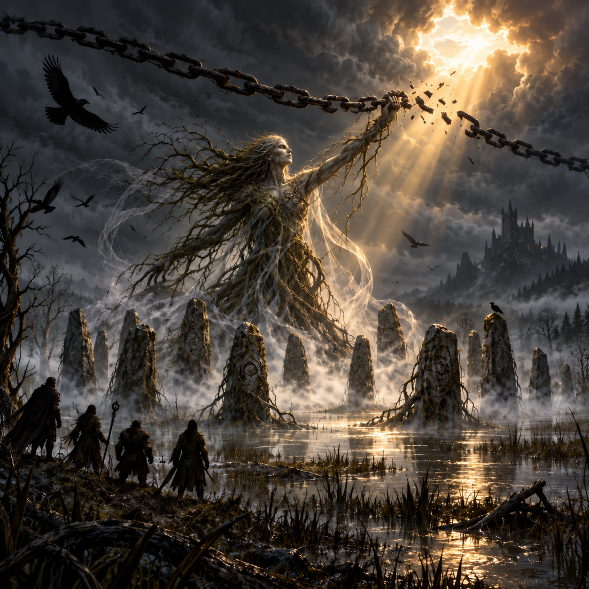

# Session 21 - The Sky Opens, the Hut Falls <small>· ~8 min read</small>

# Roster

`INPUT[inlineListSuggester(optionQuery(#Category/Player)):sessionRoster]`

Vinarius, Tildrak, Nirthar, and Borgür were all present.

## Absent

`INPUT[inlineListSuggester(optionQuery(#Category/Player)):sessionAbsent]`

None.

# Session Overview

## The Narrative

### The Truth Breaks the Sky

At the eleven menhirs of Berez, the three false glyphs vanished again as the party spoke the truths they had uncovered: Strahd had drowned the village, Marina had been killed to prevent her transformation, and Queen Ravenovia—not Baba Lysaga—was his mother. The marsh began to pulse like a heart. Across the river, the party glimpsed Berez before its destruction, then the flood sweeping through its streets and Marina's death. A vision of Baba showed her as Strahd's midwife, not his mother.

Roots and mist rose between the stones and took the shape of The Weaver. She reached into the sky, exposed black chains stretching toward Castle Ravenloft, and severed them. The Mists parted and true sunlight struck the valley. Davian Martikov, Muriel Vinshaw, Gilbert, and Susanne stood with the party in a light the younger wereravens had never seen. It lasted only moments: storm clouds gathered first above Ravenloft, then spread out to swallow the sun again.

The Weaver said the Huntress had reclaimed the power that mended Strahd's wounds. She herself had taken back an unseen ward that protected him from blows and his borrowed power to bend the border Mists, close roads, and turn travelers astray. Those stolen powers would not return to him. The Mists themselves, however, were older than Strahd, and his prison still stood. The returning storm was his own arcane answer to what he had felt break.

In thanks for the three truths, the Weaver offered three answers drawn from what the land remembered. The party asked how to leave Barovia. She answered that they were caught in Strahd's imprisonment: it could end with him, or he could be released from it, though the latter path entangled older powers in the mountains. Asked how to kill him, she spoke of stripping away his protections, including the three Fanes' stolen gifts and a defense within Ravenloft called the **Heart of Sorrow**, before defeating him in battle. She also mentioned a weapon of sunlight behind amber doors. The party spent its last question on the doors and learned that they lay in the Amber Temple on Mount Ghakis, reached through Tsolenka Pass; she warned of the winter cold. With her answers given, the Weaver's form lifted away and the roots fell still.

Another shape descended through the closing sky: the spectral hawk Borgür had once bound, now grown into a great, speaking eagle. It told him it had felt no longer needed. Borgür welcomed it back and gave it the name **Boerus**. It said it was fifteen years old. The same bird that had once followed him was now large enough to bear companions through the air, and it would soon prove able to turn briefly incorporeal.

### A House under the Tree

Vinarius still intended to recover the Wizard of Wines gemstone stolen by Baba Lysaga. His *Locate Object* found no direction, though the party could not tell whether the gem was out of range or hidden from divination. Boerus had seen Baba's walking hut and guided them across the marsh. Muriel remained with the recovering Gilbert and Susanne; Davian came toward the hut with the party, then waited back from its defenses.

Before they reached the hut, sheep ran toward them. Vinarius used *Speak with Animals* and heard their frantic order: “Find and destroy.” They crowded around him and exploded in a bloody chain, wounding him. Beyond them, motionless scarecrows stood in two rings around the hut beneath a vast tree.

The party chose a deception. Nirthar disguised himself as Rahadin and rode Boerus toward Baba's door while the others watched from cover. Thick webs strung through the branches caught bird and rider. Boerus became incorporeal and slipped free, leaving Nirthar suspended; Nirthar shattered the web with *Thunderwave*, and Boerus became solid in time to catch him. They continued to the door. Nirthar knocked and, in Rahadin's guise, announced that his master invited Baba to the wedding.

Baba answered from behind him, accusing him of stealing her child, and attacked from her giant flying skull. As the others flew to help, Nirthar sent some of Vzz'kral's Sleep-Inducing Web through a skull eye with *Mage Hand*. The web made Baba drowsy without fully disabling her. She steered the skull into the branches while Nirthar ducked inside the hut. Baba escaped, leaving the skull in the tree.

The others followed the skull through the tree. Vinarius scorched it with *Produce Flame* and Tildrak struck it with *Sacred Flame*. Borgür landed Boerus upon it and climbed through an eye socket, but found no Baba inside. He could not command the vehicle himself. The party damaged and blackened the skull further, yet did not confirm its destruction. Baba was no longer in sight.

### The Green Heart Taken

Inside the hut, Nirthar searched while the others pursued the skull. He took a potion and a poison whose precise kinds were not identified. The cooking cauldron stood cold and unnaturally clean. Beneath its coals he found a movable stone plate; below it glowed a large green gemstone caught in a tangle of living roots. He cut the roots with his shortsword. The hut shuddered and collapsed onto its own legs, throwing its contents about him, but the gem remained within reach. Nirthar carried it out of the wreckage and signaled the others.

Boerus brought the party down from the tree. Vinarius took the form of a weasel for the crowded flight away, and they collected Davian beyond the scarecrow ring. At the menhirs they reunited with Muriel, Gilbert, and Susanne and gave the recovered gemstone to Davian. The hut could no longer walk, but Baba remained at large. Vinarius retained Davian's promise to let him name the wine restored by this gem; he had not settled on a name.

The party chose Tsolenka Pass as its next destination, seeking both the final Fane, The Seeker, and the route toward the Amber Temple. They did not begin that journey before play stopped. The DM awarded the party **level 7** for returning a winery gemstone; the previous recorded advancement to level 6 was in Session 16 - The Sun's Tear.

## The Facts

*   **Weaver Restored:** The three truths freed The Weaver. She cut black chains reaching toward Ravenloft, briefly letting true sunlight strike Berez. Storm clouds returned from Ravenloft; the Mists and Strahd's imprisonment remained.
*   **Strahd's Lost Protections:** According to the Weaver, the Huntress had reclaimed the power behind his regeneration. The Weaver reclaimed an unseen ward against attacks and his borrowed control of the border Mists. She said these stolen powers would not return.
*   **Three Answers:** Leaving Barovia requires the end of Strahd's imprisonment or his release from it. To kill him, the party must overcome his remaining protections, including the Fanes' stolen gifts and the **Heart of Sorrow** within Ravenloft. A sunlight weapon lies behind amber doors in the Amber Temple on Mount Ghakis, by way of Tsolenka Pass.
*   **Borgür's Bird:** Borgür's existing spectral hawk returned as a speaking, giant-eagle-sized companion and was named **Boerus**. It said it had aged fifteen years. During play it carried riders, turned briefly incorporeal to escape a web, and became solid again to catch Nirthar.
*   **Exploding Sheep:** Sheep sent toward the party answered Vinarius's *Speak with Animals* with “Find and destroy,” then detonated around him. He took **16 damage** and received no healing before the session ended. His exact remaining hit points were not established.
*   **Gem Search:** Vinarius's *Locate Object* did not detect the winery gemstone. The cause was not established.
*   **Baba's Defense:** Motionless scarecrows guarded the hut in two rings. Webs hung above it. Baba attacked Nirthar from her flying skull after he approached disguised as Rahadin. Nirthar's sleep-inducing web affected her but did not put her fully to sleep.
*   **Baba's Fate:** Baba escaped. Her flying skull remained in the tree; Borgür found it empty, and the party did not destroy it.
*   **Hut Loot:** Nirthar took one potion and one poison. Their exact types remain unidentified.
*   **Gem Recovered:** Nirthar found the green winery gemstone below the cauldron's coals, cut it free of living roots, and escaped as the hut collapsed. The party handed the gem to Davian Martikov at the standing stones. Davian's promise that Vinarius may name the restored wine remains open.
*   **New Level:** The DM awarded the party **level 7** at the end of the session. Session 16 - The Sun's Tear records the previous rise to level 6.
*   **Final Location:** The party ended at Berez's standing stones, where Davian, Muriel, Gilbert, and Susanne were gathered. Its next intended destination is Tsolenka Pass; no mountain travel occurred in this session.

## Boerus — Rules Observed in Play

*   The DM described Boerus as Large and based on a giant eagle. It moved and spoke as Borgür's existing companion, not a second bird.
*   The DM allowed three party members to ride it on a short flight. When Boerus became incorporeal to slip through webbing, Nirthar did not become incorporeal with it. Boerus became solid again to catch him.
*   The DM read the 2014 Beast Master companion action economy during the encounter: it moved on Borgür's initiative; commanding it to Attack, Dash, Disengage, or Help used Borgür's action, and otherwise it Dodged. The party reached level 7 only at the session's end. Its final stat block and the limits of flight and incorporeality remain to be settled.

## Open Questions

*   Where did Baba Lysaga go after escaping, and will she recover the flying skull left in the tree?
*   What are the potion and poison Nirthar took from her hut?
*   What are the Heart of Sorrow's nature and location within Castle Ravenloft, and what other protections does Strahd retain?
*   How can the party free The Seeker in the heights of Tsolenka Pass?
*   How long will it take Davian to grow wine with the recovered gemstone, and what will Vinarius name it?
*   How many days remain before Strahd's wedding after the time spent in Berez? Twelve days was the last confirmed count, at the beginning of Session 20.
*   What are Boerus's final companion statistics and the limits of his incorporeal flight and carrying capacity?
